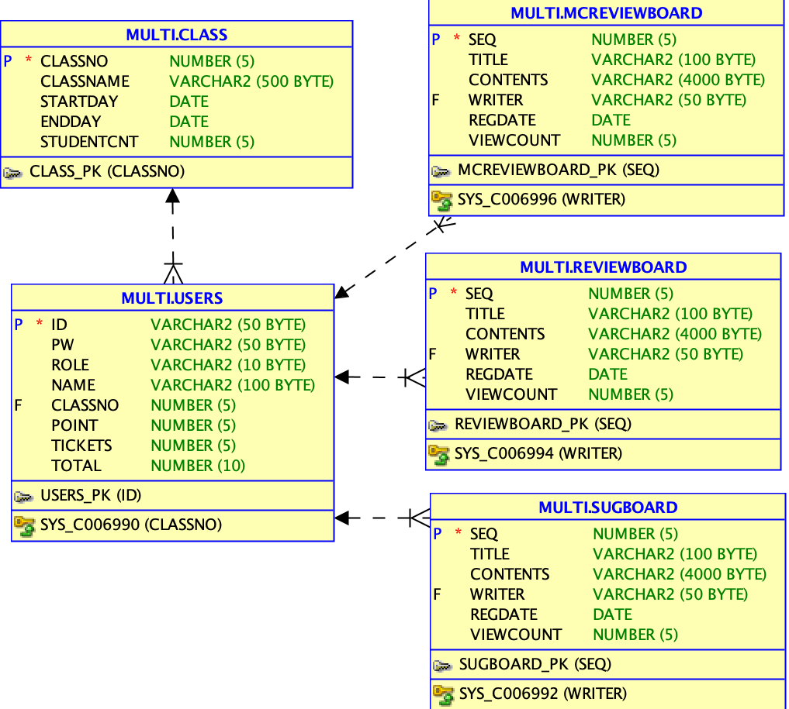

# Code Architecture

### 1. DB 구조




* db 연동

  1. project 이름에서 오른쪽 버튼 >> properties 클릭 >> build path configure >> library >> Add external library >> ojdbc6.jar 파일 추가

  2. WEB-INF 파일에 lib 폴더 만들고 ojdbc6.jar 파일 추가 

### 2. MVC 구조

* Project 이름 : Project , 기본 패키지 이름 : com.pjt.edu

* com.pjt.edu.board 패키지 : board관련 java 파일 저장 공간

  - ***VO클래스*** : 각 Board이름 + BoardVO로 이름 저장 ex) SugBoardVO.java 

    하지만, 현재 구조에서 3개의 board 테이블의 구성요소가 똑같으므로, 

    3개의 게시물 모두 현재 만들어져 있는 BoardVO 객체를 생성해서 사용하면 된다.

    따라서, 각 게시물에 맞는 ***VO 클래스를 따로 만들필요 없음*** (BoardVO 객체 사용)

  - ***DAO클래스*** : 각 Board이름 + BoadrDAO로 이름 저장 ex) SugBoardDAO.java

    -> Interface DAO 상속 필수

  - Controller클래스 : 각 Board이름 + Controller로 이름 저장 ex) SugBoardController.java

* com.pjt.edu.common 패키지 : db 관련 공통 함수 및 설정 파일 저장 공간

  * JDBCUtil.java : JDBC 로 db연동시 필요한 connection, close를 정의한 클래스

  * mybatis-config.xml : mybatis로 db연동시 필요한 설정 파일

  * user-mapping.xml : mybatis로 db연동시 필요한 user table에 해당되는 sql 문을 모아놓은 파일

  *  ***xxx-mapping.xml 파일*** : xxx는 각 테이블 이름으로 작성 ex) sugboard-mapping.xml 

    -> 생성 후에, mybatis-config에 추가 해줘야 한다.

    ```xml
    <mappers>
    	<mapper resource="com.pjt.edu.common/xxx-mapping.xml" />
    </mappers>
    ```

* com.pjt.edu.user 패키지 : 회원 정보(users)관련 java 파일 저장 공간

  * UserVO.java : Table 정보들을 일시적으로 담을 클래스
  * UserDAO.java : Users 테이블과 연동하여 사용할 함수들 정의 (JDBC)
  * UserDAO_mybatis.java : JDBC에서 mybatis로 프레임워크 수정할 때 작성할 파일
  * UserController.java : 메인페이지(main.jsp) 와 마이페이지(mypage.jsp) 단에 관련된 controller (로그인,회원정보)

* src/main/webapp 폴더 : view 단과 관련된 파일 저장 공간

  * resources/style.css : view단의 디자인 서식 모음 공간

    불러오는법 (.jsp)

    ```jsp
    <link rel="stylesheet" type="text/css" href="<%=request.getContextPath() %>/resources/style.css" />
    ```

* views 폴더 : jsp 파일(페이지) 저장 공간

  * 통합 템플릿 (jsp template 에 추가)

    ```jsp
    <%@page import="com.pjt.edu.user.UserVO"%>
    <%@ page language="java" contentType="text/html; charset=UTF-8"
    	pageEncoding="UTF-8"%>
    <!DOCTYPE html PUBLIC "-//W3C//DTD HTML 4.01 Transitional//EN"
    					"http://www.w3.org/TR/html4/loose.dtd">
    <html>
    <head>
    <meta http-equiv="Content-Type" content="text/html; charset=UTF-8">
    <title>마이페이지</title>
    <link rel="stylesheet" type="text/css"
    	href="<%=request.getContextPath()%>/resources/style.css" />
    	<script src="<%=request.getContextPath()%>/resources/js/popup.js"></script>
    	<script src="<%=request.getContextPath()%>/resources/js/popup.js?ver=2"> </script>
    </head>
    <body>
    	
    	<a id = "logo" href="./mypage">
    	</a>
    	<nav id="topMenu" class="menu">
    	<ul>
    		<li><a class="menuLink" href="./todaymenu">오늘의 메뉴</a></li>
    		<li><a class="menuLink" href="./listREV">식단 후기</a></li>
    		<li><a class="menuLink" href="./listSUG">식단 건의사항</a></li>
    		<li><a class="menuLink" href="./listMCREV">수업 후기</a></li>
    	</ul>
    	</nav>
    	<br>
    	
    
    
    
    	<nav id="topMenu" class="menu">
    	<ul>
    		<li><a class="menuLink" href="./useticket"  onclick= popup() target="_blank">식권사용</a></li>
    		<li><a class="menuLink" href="./buyticket">식권구매</a></li>
    		<li><a class="menuLink" href="./buypoint">포인트충전</a></li>
    	</ul>
    	</nav>
    	<br>
    	<footer id="bottom" class="menu">
    	<p>Posted by: 이효진, 정혜진, 최혜근, 유미선</p>
    	<p>
    		Contact information: <a href="mailto:someone@example.com">
    			someone@example.com</a>.
    	</p>
    	</footer>
    </body>
    </html>
    ```

* pom.xml

  * 버전 확인

    ```xml
    <properties>
    	<java-version>1.8</java-version>
    	<org.springframework-version>4.3.18.RELEASE</org.springframework-version>
    	<org.aspectj-version>1.6.10</org.aspectj-version>
    	<org.slf4j-version>1.6.6</org.slf4j-version>
    </properties>
    ```

  * mybatis 사용 시

    ```xml
    <!-- https://mvnrepository.com/artifact/org.springframework/spring-jdbc -->
    		<dependency>
    			<groupId>org.springframework</groupId>
    			<artifactId>spring-jdbc</artifactId>
    			<version>4.3.18.RELEASE</version>
    		</dependency>
    
		<!-- https://mvnrepository.com/artifact/org.mybatis/mybatis-spring -->
    		<dependency>
    			<groupId>org.mybatis</groupId>
    			<artifactId>mybatis-spring</artifactId>
    			<version>1.3.2</version>
    		</dependency>
    
    
    		<!-- https://mvnrepository.com/artifact/org.mybatis/mybatis -->
    		<dependency>
    			<groupId>org.mybatis</groupId>
    			<artifactId>mybatis</artifactId>
    			<version>3.4.6</version>
    		</dependency>
    
    ```
    
    

* web.xml

  ```xml
  <context-param>
  		<param-name>contextConfigLocation</param-name>
  		<param-value>
  		/WEB-INF/spring/root-context.xml
  			/WEB-INF/spring/mybatis-spring.xml
  		
  		</param-value>
  	</context-param>
  		
  
  
  
  <filter>
  		<display-name>EncodingFilter</display-name>
  		<filter-name>EncodingFilter</filter-name>
  		<filter-class>
  			org.springframework.web.filter.CharacterEncodingFilter
  		</filter-class>
  		<init-param>
  			<param-name>encoding</param-name>
  			<param-value>utf-8</param-value>
		</init-param>
  	</filter>
  	<filter-mapping>
  		<filter-name>EncodingFilter</filter-name>
  		<url-pattern>/*</url-pattern>
  	</filter-mapping> 
  
  <session-config>
          <session-timeout>15</session-timeout> 
   </session-config>
  
  ```
  
  


